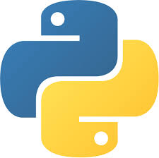

# PythonPal - Learn Python with AI! 🐍



## Overview

**PythonPal** is an interactive, AI-powered Python tutor designed especially for kids. The application combines engaging explanations, interactive coding lessons, and fun practice assessments to help build a strong foundation in Python programming. With PythonPal, learning to code becomes an adventure filled with friendly tutors, captivating stories, and sweet rewards for every correct answer!

## Features

- **Interactive Lessons:**  
  Ask questions and get immediate, kid-friendly explanations about Python concepts.
- **Practice Assessments:**  
  Every three user messages, a practice question is generated based on the current topic. Answer correctly and earn virtual chocolates 🍫 along with celebratory balloon animations!

- **Three Unique Tutor Characters:**

  - **Friendly Robot 🤖:** Provides clear and simple explanations with real-world examples.
  - **Magic Dragon 🐉:** Teaches Python using enchanting stories and adventure metaphors.
  - **Super Coder 🦸:** Challenges you with fun assignments and coding puzzles to test your skills.

- **Customizable API Key:**  
  Configure or update your Hugging Face API key directly from the sidebar in case your current key runs out of quota.

- **Kid-Friendly UI:**  
  A sleek, modern black-themed interface with playful animations and colorful elements designed to keep young learners engaged.

## Getting Started

### Prerequisites

- Python 3.7 or later
- A Hugging Face API key (register and generate your token at [Hugging Face Tokens](https://huggingface.co/settings/tokens))

### Installation

1. **Clone the repository:**

   ```bash
   git clone https://github.com/infoparth/Python-AI-Tutor.git

   ```

2. **Create and activate a virtual environment:**

   ```bash
   python -m venv venv
   # Windows:
   venv\Scripts\activate
   # macOS/Linux:
   source venv/bin/activate
   ```

3. **Install dependencies:**

   ```bash
   pip install -r requirements.txt
   ```

   _(Make sure your `requirements.txt` includes the necessary libraries such as `streamlit`, `requests`, etc.)_

4. **Configure Assets:**

   Ensure that the `assets` folder contains your logo image (e.g., `logo.png`).

### Running the Application

1. **Set your Hugging Face API Key:**

   Launch the application and enter your Hugging Face API key in the sidebar. If your API key quota is exceeded during evaluation, simply update it in the sidebar.

2. **Run the Streamlit App:**

   ```bash
   streamlit run main.py
   ```

3. **Use PythonPal:**

   - Choose your preferred tutor from the sidebar (Friendly Robot 🤖, Magic Dragon 🐉, or Super Coder 🦸).
   - Ask your questions in the "Ask your question..." input field (the text appears in white on a dark background for clarity).
   - After every three user messages, a practice assessment will appear. Answer correctly to earn chocolates!

## How It Works

- **Landing Page:**  
  The landing page gives a brief overview of PythonPal, describes its purpose and unique features, details about the tutor characters, and instructs users on how to configure the API key.

- **Chat Interface:**  
  The main chat interface allows users to interact with the AI tutor. User queries and responses are displayed in chat bubbles. The application dynamically generates practice questions based on the conversation topic.

- **Practice Assessments:**  
  Every three user messages, the system triggers a beginner-friendly practice assessment. The practice question is unique (no repeats across sessions) and rewards correct answers with virtual chocolates.

## Customization

- **Theme & Styling:**  
  The application uses custom CSS for a modern, kid-friendly black-themed interface. You can modify the CSS in the `main.py` file to adjust colors, fonts, and layouts.

- **API Integration:**  
  PythonPal uses Hugging Face’s inference API for generating responses and practice assessments. You can update the API endpoint or parameters by modifying the functions in `utils/huggingface_client.py`.
